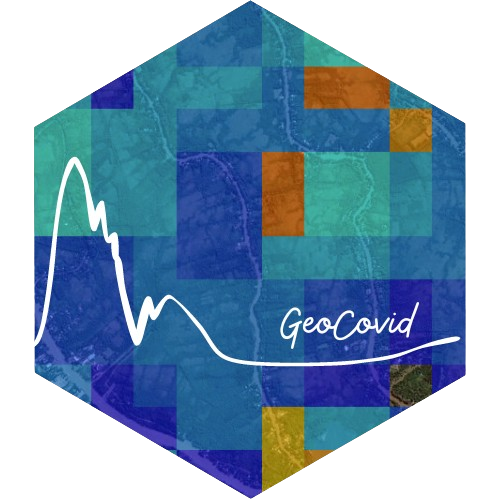

# GeoCovidApp Buenos Aires 

<!-- README.md is generated from README.Rmd. Please edit that file -->

```{r, include = FALSE}
knitr::opts_chunk$set(
  collapse = TRUE,
  comment = "#>",
  fig.path = "man/figures/README-",
  out.width = "100%"
)
```


<!-- badges: start -->

[](https://github.com/Fernandez-Lab-WSU/geocovidapp_buenos-aires/actions/workflows/rmd-check.yaml)
[](https://codecov.io/gh/Fernandez-Lab-WSU/geocovidapp)
[](https://lifecycle.r-lib.org/articles/stages.html#experimental)
<!-- badges: end -->

GeoCovid App es una aplicación para visualizar datos de movilidad ciudadana en la provincia de Buenos Aires durante el período de marzo a diciembre de 2020. Permite explorar mapas raster de movilidad para tres momentos del día (mañana, tarde y noche) y observar la información desagregada por partido, junto con los casos diarios de COVID-19.

La app cuenta con tres secciones principales:  
- **Movilidad Buenos Aires:** Visualización de rasters de movilidad por hora del día.  
- **Por partido:** Datos desagregados a nivel partido junto con casos COVID-19.  
- **Panorama Buenos Aires:** Promedios diarios y nocturnos para la provincia.  

---

## Instalación

### Requisitos
- Accesso al servidor con los rasters de movilidad humana.
- R (versión 4.0 o superior)  
- Paquete `devtools` para instalar desde GitHub.

Puedes instalar la app directamente desde GitHub ejecutando en R:

```r
install.packages("devtools")
devtools::install_github("Fernandez-Lab-WSU/geocovidapp_buenos-aires")
library(geocovidapp)
# Ejecuta el dashboard
run_app()
```

## Ejecutar la app con Docker

Si querés correr la app sin instalar R ni dependencias locales, podés usar Docker.
 
### Requisitos

- Tener Docker instalado en tu sistema.  
  [https://docs.docker.com/get-docker/](https://docs.docker.com/get-docker/)

### Construir la imagen

Desde la raíz del repositorio (donde está el Dockerfile), ejecutá:

```bash
docker build -t geocovidapp .
```

Esto crea la imagen Docker llamada geocovidapp con la app y todas las dependencias.
Correr la app

Para iniciar la app en un contenedor y exponerla en el puerto 3838:

```bash
docker run -p 3838:3838 geocovidapp
```
Luego abrí en tu navegador: `http://localhost:3838`


---

## Proyectos relacionados

El paquete `quadkeyr`, GeoCovid Buenos Aires y GeoCovid App forman parte de un mismo proyecto:

- [Paquete `quadkeyr`](https://github.com/Fernandez-Lab-WSU/quadkeyr)  
  Herramienta para análisis de datos de movilidad ciudadana de Meta y su conversión a imágenes raster.

- [GeoCovid Buenos Aires](https://github.com/Fernandez-Lab-WSU/geocovid_bsas)  
  Website con reportes que documentan el procesamiento de datos COVID-19, movilidad, mapas vectoriales y rasters para la provincia.

---

## Licencias

El código de este repositorio está bajo [licencia MIT](https://github.com/Fernandez-Lab-WSU/geocovidapp_buenos-aires/blob/main/LICENSE.md).

---

## Cita el dashboard

> D'Andrea, F. GeoCovid Buenos Aires [Computer software].  
> Dr. Fernandez Lab. Washington State University.  
> https://github.com/Fernandez-Lab-WSU/geocovidapp

---

## Código de Conducta

El proyecto GeoCovid Buenos Aires, GeoCovid app y el paquete `quadkeyr` se rigen por un [Código de Conducta](https://www.contributor-covenant.org/es/version/1/4/code-of-conduct/).

---

## Referencias

- Ramírez ML, Martinez SM, Bessone CDV, Allemandi DA, Quinteros DA. COVID-19:  
  [Epidemiological Situation of Argentina and its Neighbor Countries after Three Months of Pandemic.](https://www.ncbi.nlm.nih.gov/pmc/articles/PMC8193186/)  
  Disaster Med Public Health Prep. 2022 Oct;16(5):1935-1941.  
  doi: 10.1017/dmp.2021.90. Epub 2021 Mar 25. PMID: 33762042; PMCID: PMC8193186.
